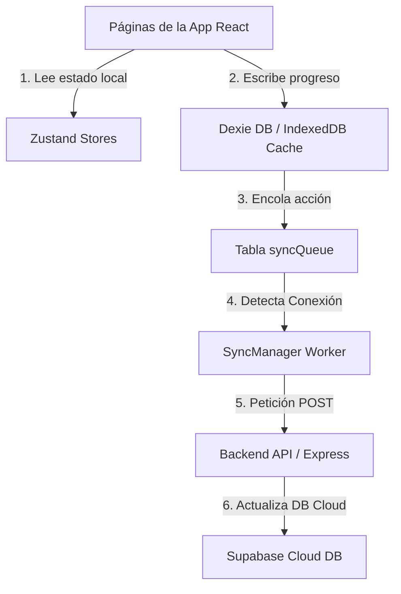

# 🏛️ Resumen de Arquitectura (Architecture Overview)

Este documento describe la estructura y responsabilidades de las distintas carpetas y módulos del proyecto **FinEmpoder**, facilitando la incorporación de nuevos desarrolladores y garantizando la coherencia técnica del sistema.

---

## 📂 Estructura General del Proyecto

```
finempoder/
├── .agent/                  # Configuración de agentes, reglas y workflows (ECC)
├── backend/                 # API REST (Express.js + TypeScript)
│   ├── src/
│   │   ├── config/          # Variables de entorno y configuraciones iniciales
│   │   ├── controllers/     # Controladores de la API (lógica de endpoints)
│   │   ├── lib/             # Clientes de servicios externos y utilidades clave (Supabase, Sentry)
│   │   ├── middlewares/     # Middlewares (autenticación JWT, validación)
│   │   ├── routes/          # Declaración de rutas Express
│   │   ├── schemas/         # Validaciones Zod para payloads de entrada
│   │   ├── types/           # Definiciones de tipos TypeScript compartidos
│   │   └── utils/           # Clases y funciones helper genéricas
│   └── test/                # Pruebas unitarias y de integración
├── frontend/                # Aplicación PWA (React 19 + TypeScript + Vite)
│   ├── scripts/             # Checklists de verificación automatizada de módulos
│   ├── src/
│   │   ├── api/             # Cliente Axios configurado para llamadas al backend
│   │   ├── db/              # Base de datos local Dexie (IndexedDB) y repositorios
│   │   ├── features/        # Módulos de negocio (autenticación, lecciones, gamificación)
│   │   ├── hooks/           # React Hooks reutilizables
│   │   ├── lib/             # Inicializaciones externas (Supabase client, Sentry, SyncManager)
│   │   ├── module-kit/      # Motor genérico declarativo para flujo de lecciones
│   │   ├── pages/           # Vistas principales de la app por ruta
│   │   ├── store/           # Estados globales de Zustand (auth, progress, lessons)
│   │   └── shared/          # Componentes y helpers genéricos de UI
│   └── test/                # Configuración de tests e integración con Vitest
└── supabase/                # Base de datos cloud y autenticación
    └── migrations/          # Migraciones SQL que definen el esquema y políticas RLS
```

---

## 🔄 Interacción entre Componentes

La aplicación está diseñada bajo una arquitectura **offline-first**. El flujo de lectura y escritura de datos del estudiante sigue este orden:



1. **Lectura y Renderizado:** El frontend lee principalmente del store reactivo de **Zustand** y de **Dexie** (base de datos local en el navegador).
2. **Escritura offline-first:** Cuando un usuario completa una lección o gana XP, los datos se escriben inmediatamente en **Dexie** de forma síncrona.
3. **Cola de Sincronización:** Una acción de sincronización se encola en la tabla `syncQueue` de Dexie.
4. **Despacho del SyncManager:** El worker `SyncManager` procesa la cola cuando hay conexión a Internet y envía peticiones al backend Express en la ruta `/api/progress/lesson-completed`.
5. **Backend y Persistencia:** El backend valida la petición y actualiza las tablas `lesson_progress` y `gamification` en **Supabase** usando privilegios de administrador (`service_role`).

---

## 🛡️ RLS (Row Level Security) y Acceso a Datos

Toda la base de datos de Supabase está protegida con políticas **RLS**:
* **Usuarios comunes:** Tienen acceso de lectura exclusivo a sus propias filas en `profiles`, `lesson_progress`, `gamification`, `questionnaire_results` y `budgets`.
* **Administradores:** Tienen políticas de lectura globales (`admin lee todo`) en tablas clave de investigación para analizar el desempeño académico de los estudiantes.
* **El Backend (Express):** Actúa como el orquestador principal y gestiona los inserts/updates mediante el cliente de Supabase con `service_role` (saltándose RLS de forma segura) tras realizar validaciones de negocio en el servidor.
