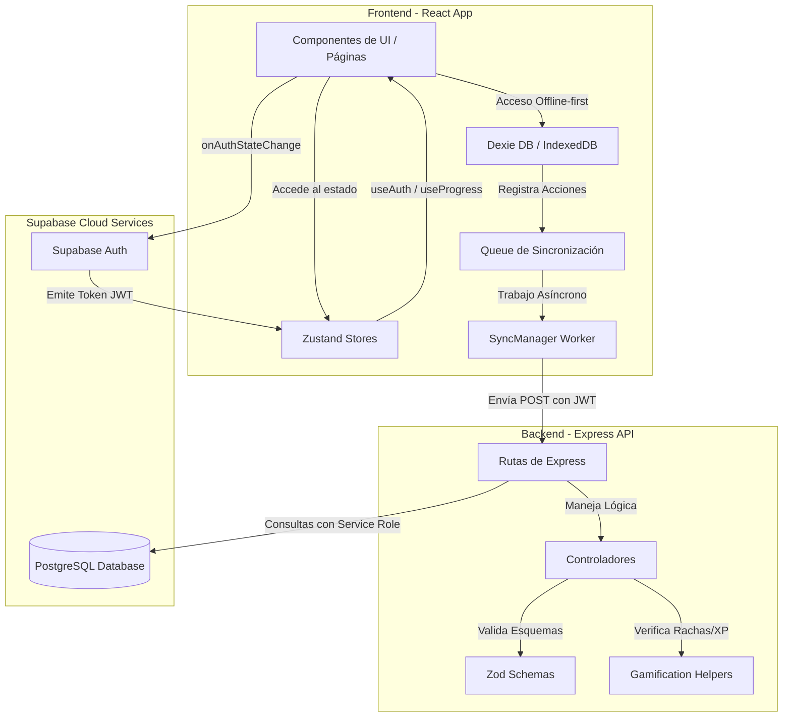

# 📊 Grafo de Dependencias (Dependency Graph Codemap)

Este documento contiene la definición textual y lógica en formato Mermaid del flujo de dependencias de **FinEmpoder**. También puedes ver el diagrama visual detallado en formato vectorial en [dependency-graph.svg](file:///c:/Proyectos/finempoder/docs/CODEMAPS/dependency-graph.svg).

---

## 🗺️ Mapa de Flujo de Datos y Dependencias

A continuación se muestra cómo dependen los diferentes módulos de la aplicación:

---

## 🔍 Detalles del Flujo de Sincronización offline-first

1. **Persistencia Síncrona:** Cuando el usuario completa una lección, `useLessonProgress` escribe de manera síncrona en `lessonProgressRepository`, guardando los datos directamente en IndexedDB (Dexie).
2. **Registro de la Cola:** Inmediatamente se añade la acción en la tabla `syncQueue` (Dexie) mediante `SyncManager.enqueue()`.
3. **Conexión de Red:**
   * Si el dispositivo está **online**, `SyncManager.flush()` es llamado inmediatamente.
   * Si está **offline**, `SyncManager` escucha el evento `'online'` de la API del navegador (`window.addEventListener('online', ...)`).
4. **Despacho del Lote:** Al volver la conexión, `SyncManager` lee secuencialmente las acciones pendientes de la base de datos local y realiza llamadas POST seguras al backend usando el JWT de autorización en memoria.
5. **Persistencia en la Nube:** El backend procesa las solicitudes una a una, recalcula las estadísticas del usuario en tiempo real y guarda los cambios en Supabase Cloud. Si falla la llamada, se aplica un mecanismo de **reintento exponencial (backoff)** para proteger la consistencia de los datos.
